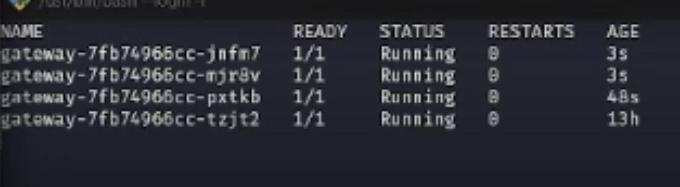
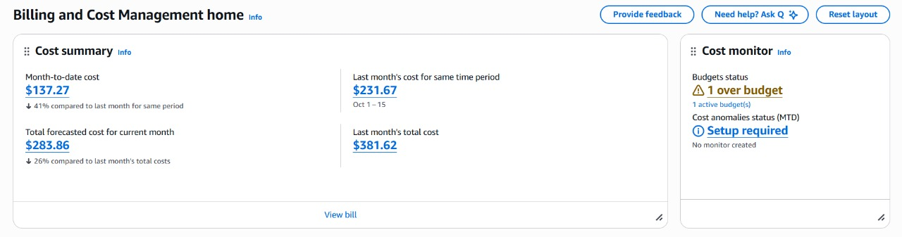

!!! info "Integrantes do Projeto"
    
    Este projeto foi desenvolvido pelos seguintes integrantes:
    - Felipe Mariano Ferreira
    - [Luise Pessoa]
    - [Luigi Lopez Carmona]

!!! tip "Link contendo todos repositorios usados"
    
    - **[Account Service](https://github.com/orgs/microservices-architecture-example/repositories)**

---

## AWS

Configurar AWS CLI:

Para configurar a AWS CLI, siga as instruções oficiais da documentação da AWS. A instalação varia conforme o sistema operacional (Linux, macOS ou Windows).

!!! info "Documentação AWS CLI"

    Para mais detalhes sobre instalação e configuração, consulte a [documentação oficial da AWS CLI](https://docs.aws.amazon.com/cli/latest/userguide/getting-started-install.html).

Instalação e configuração:
```bash
aws configure
```

---

## EKS

Cluster EKS configurado com nome `eks-store`, Kubernetes versão 1.32, política de upgrade Standard, EKS Auto Mode desabilitado, VPC customizada com 4 subnets (2 públicas e 2 privadas em diferentes zonas de disponibilidade), família de endereços IP IPv4, e endpoint do cluster configurado como público e privado.

{width = 100%}

Conectar no cluster:
```bash
aws eks update-kubeconfig --name eks-store
```

---

## Testes de Carga

Testes de carga realizados para validar o desempenho da aplicação.

### Vídeo Demonstrativo

<iframe width="100%" height="500" src="https://www.youtube.com/embed/z8U1omH1igE" frameborder="0" allow="accelerometer; autoplay; clipboard-write; encrypted-media; gyroscope; picture-in-picture" allowfullscreen></iframe>

### Foto do terminal

{width = 100%}

---

## CI/CD

Jenkins utilizado para automação do processo de integração e entrega contínua.

### Pipeline Jenkins

```groovy
pipeline {
    agent any
    environment {
        SERVICE = 'account'   
        NAME = "luigilopesz/${env.SERVICE}"  
        AWS_REGION  = 'sa-east-1'
        EKS_CLUSTER = 'eks-store'
    }
    stages {
        stage('Dependecies') {
            steps {
                // dispara o job da interface correspondente e aguarda concluir
                build job: "${env.SERVICE}", wait: true
            }
        }
        stage('Build') { 
            steps {
                sh 'mvn -B -DskipTests clean package'
            }
        }      
        stage('Build & Push Image') {
            steps {
                withCredentials([usernamePassword(
                    credentialsId: 'dockerhub-credential',
                    usernameVariable: 'USERNAME',
                    passwordVariable: 'TOKEN')]) {
                    sh "docker login -u $USERNAME -p $TOKEN"

                    // builder multi-arch efêmero
                    sh "docker buildx create --use --platform=linux/arm64,linux/amd64 --driver-opt network=host --node multi-platform-builder-${env.SERVICE} --name multi-platform-builder-${env.SERVICE}"

                    // build + push tags :latest e :BUILD_ID
                    sh "docker buildx build --platform=linux/arm64,linux/amd64 --push --tag ${env.NAME}:latest --tag ${env.NAME}:${env.BUILD_ID} -f Dockerfile ."

                    // limpeza do builder
                    sh "docker buildx rm --force multi-platform-builder-${env.SERVICE}"
                }
            }
        }
        stage('Deploy to EKS') {
            agent {
                // Use a docker agent with AWS CLI. Kubectl will be installed in the steps.
                docker {
                    image 'amazon/aws-cli:latest'
                    args '--entrypoint=""'
                }
            }
            steps {
                // Usa credenciais AWS do Jenkins (Access Key / Secret)
                withCredentials([[$class: 'AmazonWebServicesCredentialsBinding',
                credentialsId: 'aws-credential',
                accessKeyVariable: 'AWS_ACCESS_KEY_ID',
                secretKeyVariable: 'AWS_SECRET_ACCESS_KEY']]) {
                sh """
                    # Instala o kubectl, necessário para os comandos seguintes
                    curl -LO "https://dl.k8s.io/release/\$(curl -L -s https://dl.k8s.io/release/stable.txt)/bin/linux/amd64/kubectl"
                    chmod +x ./kubectl
                    mv ./kubectl /usr/local/bin/

                    # garante diretório padrão do kubeconfig
                    mkdir -p ~/.kube

                    # configura contexto do cluster no caminho padrão (~/.kube/config)
                    aws eks update-kubeconfig --region ${AWS_REGION} --name ${EKS_CLUSTER}

                    kubectl config current-context

                    # Aplica as configurações do k8s.
                    # Isso vai criar o deployment se não existir, ou atualizá-lo se já existir.
                    kubectl apply -f ./k8s/

                    # atualiza a imagem do Deployment
                    kubectl set image deploy/${SERVICE} ${SERVICE}=${NAME}:${BUILD_ID} --record

                    # espera o rollout
                    kubectl rollout status deployment/${SERVICE} --timeout=180s
                """
                }
            }
        }
    }
}
```

{width = 100%}

---

## Custos

!!! warning "Atenção"
    
    **Os custos dos meses anteriores a novembro de 2025 não são do nosso grupo.** A análise abaixo considera apenas os custos relevantes ao nosso projeto a partir de novembro de 2025.

### Análise de Custos

**Custo mês atual (até o momento):** USD 137.27, representando uma redução de 41% comparado ao mesmo período do mês anterior (USD 231.67).

**Previsão total para o mês atual:** USD 283.86, com redução de 26% comparado ao mês anterior que teve custo total de USD 381.62.

**Principais serviços que compõem os custos:**
- **EC2 - Other:** Maior componente de custo
- **Amazon Elastic Container Service for Kubernetes (EKS):** Custos relacionados ao cluster Kubernetes
- **Amazon Elastic Load Balancing:** Balanceamento de carga
- **Amazon Virtual Private Cloud (VPC):** Infraestrutura de rede
- **Tax:** Impostos aplicáveis
- **Outros serviços:** Demais componentes da infraestrutura

**Observações:**
- Novembro de 2025 apresentou uma redução significativa nos custos (aproximadamente USD 120), representando menos de um terço dos custos médios dos meses anteriores.
- Status de orçamento: 1 orçamento ativo com 1 alerta de ultrapassagem.
- Monitoramento de anomalias: Não configurado.

{width = 100%}

{width = 100%}

---

## PaaS - Platform as a Service

A plataforma como serviço (PaaS) é um modelo de computação em nuvem que fornece uma plataforma para desenvolver, executar e gerenciar aplicativos sem a complexidade de construir e manter a infraestrutura normalmente associada ao desenvolvimento e lançamento de aplicativos.

### Serviços PaaS Utilizados

=== "Amazon EKS"

    Serviço gerenciado que facilita a execução de Kubernetes na AWS, gerenciando automaticamente a disponibilidade e escalabilidade do cluster.

    **Benefícios:**
    - Gerenciamento simplificado do cluster Kubernetes
    - Integração nativa com serviços AWS
    - Alta disponibilidade e escalabilidade automática
    - Segurança e conformidade integradas

=== "Elastic Load Balancing"

    Distribui automaticamente o tráfego de aplicações entre múltiplos destinos, garantindo alta disponibilidade e tolerância a falhas.

    **Benefícios:**
    - Distribuição automática de carga
    - Alta disponibilidade e tolerância a falhas
    - Escalabilidade automática
    - Integração com serviços AWS

=== "Amazon RDS"

    Serviço de banco de dados relacional gerenciado que automatiza tarefas administrativas como backups, patches e escalabilidade.

    **Benefícios:**
    - Gerenciamento automatizado de backups
    - Escalabilidade fácil
    - Alta disponibilidade com Multi-AZ
    - Monitoramento e métricas integradas

=== "CloudWatch"

    Serviço de monitoramento e observabilidade que coleta logs, métricas e eventos, fornecendo uma visão unificada dos recursos AWS.

    **Benefícios:**
    - Monitoramento em tempo real
    - Alertas e notificações automáticas
    - Análise de logs centralizada
    - Visualização de métricas e dashboards
