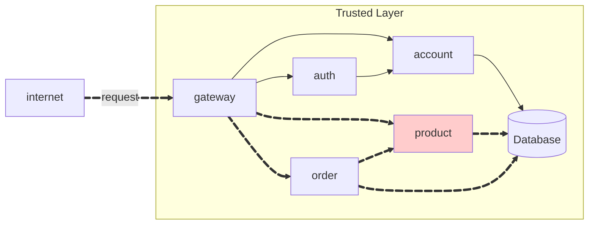

Create a RESTful API resource `product` for a store.




!!! warning "Attention"

    **To consume the API, the user must be authenticated.**

## Product API

**link product:**
[https://github.com/felipemarianoferr/pma.25.2.product](https://github.com/felipemarianoferr/pma.25.2.product)

**link product service:**
[https://github.com/felipemarianoferr/pma.25.2.product-service](https://github.com/felipemarianoferr/pma.25.2.product-service)

The API should have the following endpoints:

!!! info "POST /product"

    Create a new product.

    === "Request"

        ``` { .json .copy .select linenums='1' }
        {
            "name": "Tomato",
            "price": 10.12,
            "unit": "kg"
        }
        ```

    === "Response"

        ``` { .json .copy .select linenums='1' }
        {
            "id": "0195abfb-7074-73a9-9d26-b4b9fbaab0a8",
            "name": "Tomato",
            "price": 10.12,
            "unit": "kg"
        }
        ```
        ```bash
        Response code: 201 (created)
        ```
    
    === "postman"

        {width = 100%}


!!! info "GET /product"

    Get all products.

    === "Response"

        ``` { .json .copy .select linenums='1' }
        [
            {
                "id": "0195abfb-7074-73a9-9d26-b4b9fbaab0a8",
                "name": "Tomato",
                "price": 10.12,
                "unit": "kg"
            },
            {
                "id": "0195abfe-e416-7052-be3b-27cdaf12a984",
                "name": "Cheese",
                "price": 0.62,
                "unit": "slice"
            }
        ]
        ```
        ```bash
        Response code: 200 (ok)
        ```

    === "postman"

        {width = 100%}

!!! info "GET /product/{id}"

    Get a product by its ID.

    === "Response"

        ``` { .json .copy .select linenums='1' }
        {
            "id": "0195abfb-7074-73a9-9d26-b4b9fbaab0a8",
            "name": "Tomato",
            "price": 10.12,
            "unit": "kg"
        }
        ```
        ```bash
        Response code: 200 (ok)
        ```
    
    === "postman"

        {width = 100%}

!!! info "DELETE /product/{id}"

    Delete a product by its ID.
    === "Response"
        ```bash
        Response code: 204 (no content)
        ```

    === "postman"

        {width = 100%}
