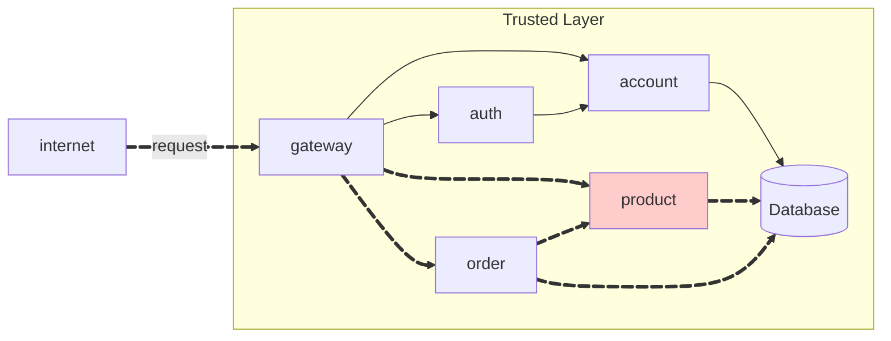

Create a RESTful API resource `ORDER` for a store.




!!! warning "Attention"

**To consume the API, the user must be authenticated.**

## Order API

**link order:**
[https://github.com/felipemarianoferr/pma.25.2.order](https://github.com/felipemarianoferr/pma.25.2.order)

**link order service:**
[https://github.com/felipemarianoferr/pma.25.2.order-service](https://github.com/felipemarianoferr/pma.25.2.order-service)

The API have the following endpoints:

!!! info "POST /order"

    Create a new order **for the current user**.

    === "Request"

        ``` { .json .copy .select linenums='1' }
        {
            "items": [
                {
                    "idProduct": "0195abfb-7074-73a9-9d26-b4b9fbaab0a8",
                    "quantity": 2
                },
                {
                    "idProduct": "0195abfe-e416-7052-be3b-27cdaf12a984",
                    "quantity": 1
                }
            ]
        }
        ```

    === "Response"

        ``` { .json .copy .select linenums='1' }
        {
            "id": "0195ac33-73e5-7cb3-90ca-7b5e7e549569",
            "date": "2025-09-01T12:30:00",
            "items": [
                {
                    "id": "01961b9a-bca2-78c4-9be1-7092b261f217",
                    "product": {
                        "id": "0195abfb-7074-73a9-9d26-b4b9fbaab0a8"
                    },
                    "quantity": 2,
                    "total": 20.24
                },
                {
                    "id": "01961b9b-08fd-76a5-8508-cdb6cd5c27ab",
                    "product": {
                        "id": "0195abfe-e416-7052-be3b-27cdaf12a984"
                    },
                    "quantity": 10,
                    "total": 6.2
                }
            ],
            "total": 26.44
        }
        ```
        ```bash
        Response code: 201 (created)
        Response code: 400 (bad request), if the product does not exist.
        ```
    === "postman"

        {width = 100%}

!!! info "GET /order"

    Get all orders **for the current user**.

    === "Response"

        ``` { .json .copy .select linenums='1' }
        [
            {
                "id": "0195ac33-73e5-7cb3-90ca-7b5e7e549569",
                "date": "2025-09-01T12:30:00",
                "total": 26.44
            },
            {
                "id": "0195ac33-cbbd-7a6e-a15b-b85402cf143f",
                "date": "2025-10-09T03:21:57",
                "total": 18.6
            }
            
        ]
        ```
        ```bash
        Response code: 200 (ok)
        ```

    === "postman"

        {width = 100%}

!!! info "GET /order/{id}"

    Get the order details by its ID. **The order must belong to the current user.**, otherwise, return a `404`.

    === "Response"

        ``` { .json .copy .select linenums='1' }
        {
            "id": "0195ac33-73e5-7cb3-90ca-7b5e7e549569",
            "date": "2025-09-01T12:30:00",
            "items": [
                {
                    "id": "01961b9a-bca2-78c4-9be1-7092b261f217",
                    "product": {
                        "id": "0195abfb-7074-73a9-9d26-b4b9fbaab0a8",
                    },
                    "quantity": 2,
                    "total": 20.24
                },
                {
                    "id": "01961b9b-08fd-76a5-8508-cdb6cd5c27ab",
                    "product": {
                        "id": "0195abfe-e416-7052-be3b-27cdaf12a984",
                    },
                    "quantity": 10,
                    "total": 6.2
                }
            ],
            "total": 26.44
        }
        ```
        ```bash
        Response code: 200 (ok)
        Response code: 404 (not found), if the order does not belong to the current user.
        ```
    
    === "postman"

        {width = 100%}
