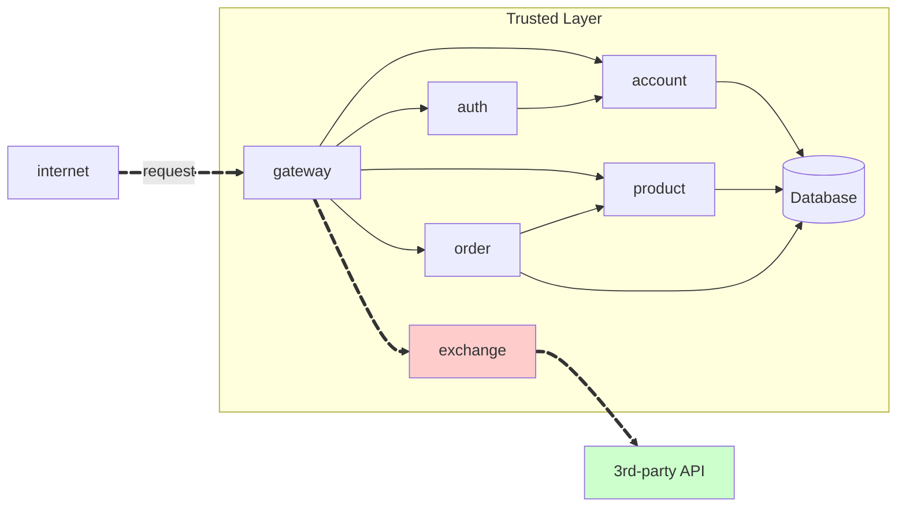

Create a RESTful API resource `Exchange` Using FastAPI[^1] for a store.



## Exchange API

**link exchange:**
[https://github.com/felipemarianoferr/store.exchange](https://github.com/felipemarianoferr/store.exchange)

!!! warning "Attention"

    **To consume the API, the user must be authenticated.**

!!! info "GET /exchange/{from}/{to}"

    Get the current of a coin from one currency to another. E.g. `GET /coin/USD/EUR`.

    === "Response"

        ``` { .json .copy .select linenums='1' }
        {
            "sell": 0.82,
            "buy": 0.80,
            "date": "2021-09-01 14:23:42",
            "id-account": "0195ae95-5be7-7dd3-b35d-7a7d87c404fb"
        }
        ```
        ```bash
        Response code: 200 (ok)
        ```
    
    === "postman"

        {width = 100%}